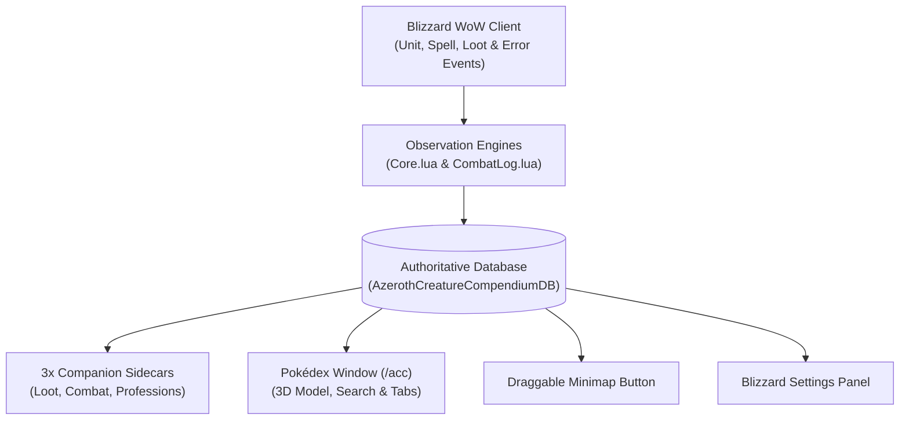

# Azeroth Creature Compendium

[](https://worldofwarcraft.blizzard.com/)
[](docs/ARCHITECTURE.md)
[](docs/ARCHITECTURE.md)
[](LICENSE)

**A Pokédex for every creature you encounter across World of Warcraft Classic.**

The **Azeroth Creature Compendium (ACC)** dynamically observes, catalogs, and indexes every mob you encounter on your journey. As you explore, fight, and loot, the compendium records:
- **Mob Identity & Visual Classification**: Level ranges, creature type/family (Beast, Humanoid, Undead, Dragonkin, etc.), and distinctive badge styling:
  - 🥈 **Rare Spawns**: Silver styling with persistent discovery coordinates.
  - 🥇 **Elites**: Authentic golden styling highlighting dangerous world encounters.
- **Combat Profile & Auto-Attacks**: Melee swing damage ranges (min, max, average) and damage school.
- **Spells & Abilities**: Every spell cast by the mob, tracked with spell icon, damage/healing values, buffs/debuffs, and cast frequency.
- **Taint-Free Immunities Verification**: Automatically identifies creature immunities as they happen in combat—including **Spell Schools** (*Fire, Frost, Nature, Shadow, Arcane, Holy, Physical*) and **Mechanics** (*Taunt, Bleed, Stun, Polymorph, Fear, Snare/Root, Silence, Sleep, Poison*).
- **Loot Table & Drop Rates**: Exact percentage (%) and decimal drop chances, sample sizes (e.g. `4/28 drops`), empty loot occurrences, and average coin drop.
- **Profession Corpse Harvesting**: Separate tracking for Skinning, Mining, Herbalism, and Engineering corpse gathers with individual drop rates and harvest counts.

---

> ### 🧭 Core Philosophy: Journey Before Destination
> This addon is developed with the core gameplay pillar of **Journey Before Destination**. While there may be many addons out there that have all this information baked in, and you can absolutely Google this and get all the answers on Wowhead, I felt that in the spirit of the game I wanted something that feels like an explorer's journal you are appending to as you play. You may not have all the info today, but if you keep playing you will keep accruing it and you can reference your personal compendium at any time.

---

## 🏗️ System Architecture Overview

The compendium follows a decoupled, event-driven architecture designed for zero game taint, zero performance overhead, and low memory consumption:



> 📖 **Deep Dive Documentation:**  
> For complete component diagrams, lifecycle sequence diagrams, database schemas, taint-safety design decisions, and AI agent guidelines, refer to **[docs/ARCHITECTURE.md](docs/ARCHITECTURE.md)**.

---

## 🏛️ Data Hierarchy

The compendium organizes all data into an intuitive, scalable tree:

```text
Zone (e.g., Elwynn Forest / Westfall / Dun Morogh)
  └── Mob (e.g., Hogger / Timber / Vagash)
        ├── Metadata: Level range, Classification (Rare/Elite), Creature Family, Kills, First/Last seen
        ├── Coordinates: Verified map coordinates (strictly tracked for Rare Spawns)
        ├── Combat (Sibling Child 1):
        │     ├── Melee / Auto-Attacks (Min, Max, Avg damage, Swings)
        │     ├── Spells & Abilities (Icons, Schools, Cast counts, Damage/Heals)
        │     └── Known Immunities (Fire, Nature, Taunt, Bleed, etc.)
        ├── Loot (Sibling Child 2):
        │     ├── Drop rate percentages (%) and decimals
        │     ├── Occurrence counts & sample sizes
        │     ├── Empty loot tracking
        │     └── Average copper/silver/gold drop
        └── Professions (Sibling Child 3):
              ├── Skinning, Mining, Herbalism, and Engineering corpse drops
              ├── Harvest counts & drop rates per gathered item
              └── Skill breakdown (e.g. Skinning vs Mining)
```

---

## 🎮 Features

### 1. Three Companion Sidecar Tooltips
- **Loot Tooltip (Default: `[SHIFT]`):** Displays the mob's full item drop table, drop chance percentages, and average coin dropped.
- **Combat Tooltip (Default: `[CTRL]`):** Displays the mob's level, classification, verified immunities badges, auto-attack damage range, and spells cast with damage and spell school colors.
- **Profession Tooltip (Default: `[ALT]`):** Displays the mob's gathered profession loot table (Skinning, Mining, Herbalism, Engineering) with drop chance percentages, sample sizes, and skill badges.
- **Multi-Docking Mode:** When holding multiple keys, all active sidecars dock cleanly side-by-side next to Blizzard's `GameTooltip` with zero overlap.
- **Real-Time Key Detection:** Modifiers toggle immediately on key press or release while hovering over a mob.

### 2. Standalone Three-Tab Pokédex Browser (`/acc`)
- **Left Registry Pane:** Searchable tree listing all discovered zones and mobs.
- **Right Pokédex Entry Card:**
  - **3D Interactive Creature Model:** Rendered in real-time with 360-degree mouse drag rotation.
  - **Distinct Visual Classification:** Silver rarity tags for rare spawns with coordinates; golden tags for elite encounters.
  - **[Combat & Abilities] Tab:** Displays verified immunities in color-coded badges, melee damage, and every spell cast by the creature. Hovering any spell displays the full Blizzard spell tooltip!
  - **[Loot Table] Tab:** Shows total loot sessions, empty loots, average coin, and a scrollable table of all drops with quality colors and drop rates. Shift-click any item to link it in chat!
  - **[Professions] Tab:** Dedicated harvesting loot table consolidated for Skinning, Mining, Herbalism, and Engineering corpse gathers! Tracks harvest counts, drop rates, and tags each drop with its gathering skill.
- **Fast Search:** Live filtering across Zone names, Creature names, Spells/Attacks, Loot items, or Profession materials.

### 3. Draggable Minimap Tome Icon
- Authentic golden tome icon framed in warm classic bronze.
- Dynamically calculates distance to match custom HUD scale and Edit Mode adjustments.
- **Left-Click:** Open Pokédex Window.
- **Right-Click:** Open Addon Settings.
- **Left-Drag:** Move around the minimap rim.

---

## ⌨️ Slash Commands

Use `/acc`, `/compendium`, `/pokedex`, or the legacy aliases `/bgl` / `/bgloot`:

| Command | Action |
| :--- | :--- |
| `/acc` | Toggle the Pokédex Compendium Browser window |
| `/acc options` | Open the Blizzard Interface Settings panel |
| `/acc minimap` | Toggle the minimap tome button |
| `/acc status` | Print database summary (creatures, spells, drops, immunities) |
| `/acc lootkey <SHIFT\|CTRL\|ALT\|NONE>` | Configure hotkey for Loot tooltip |
| `/acc combatkey <SHIFT\|CTRL\|ALT\|NONE>` | Configure hotkey for Combat tooltip |
| `/acc profkey <SHIFT\|CTRL\|ALT\|NONE>` | Configure hotkey for Profession tooltip |
| `/acc max <1-25>` | Change maximum items displayed in tooltip |
| `/acc lookup <name>` | Search recorded creature in chat |
| `/acc reset confirm` | Permanently wipe recorded history |

---

## 🔄 Automatic Data Migration
- **Legacy Migration:** If you previously used `BgLootLogger`, your existing database (`BgLootLoggerDB`) is **automatically detected and migrated** into `AzerothCreatureCompendiumDB` on first launch with zero data loss.
