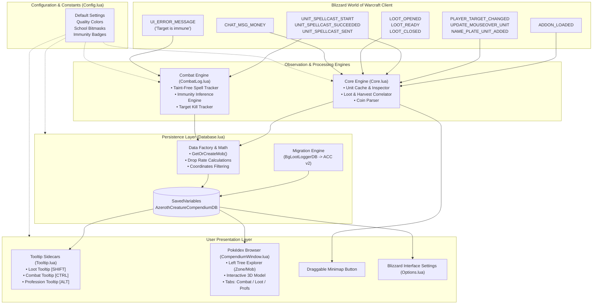
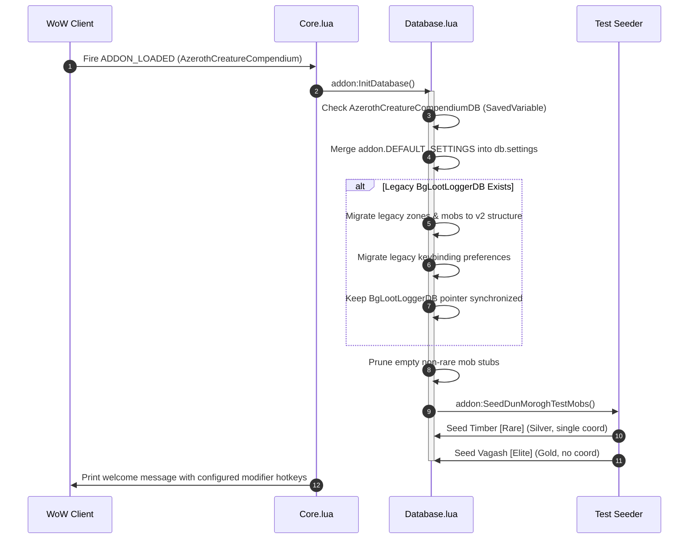
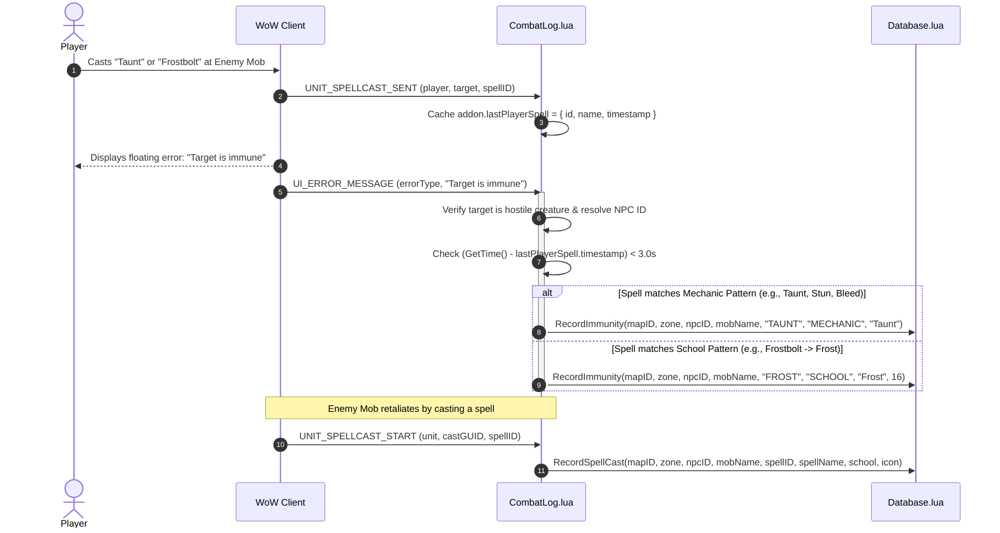
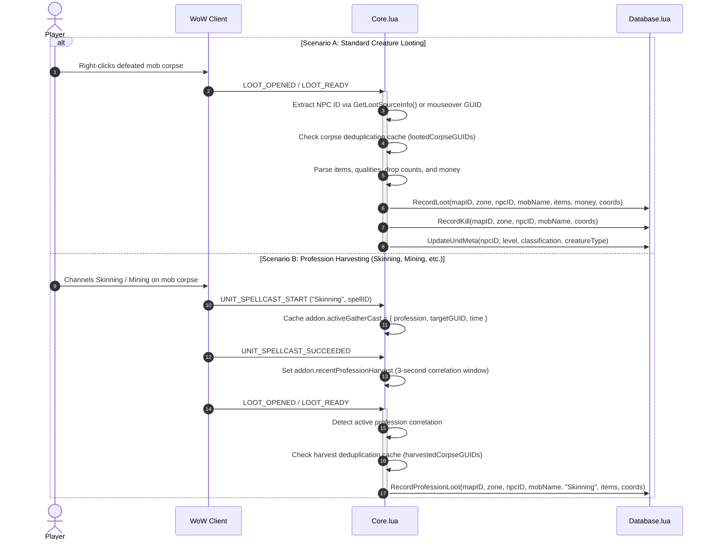
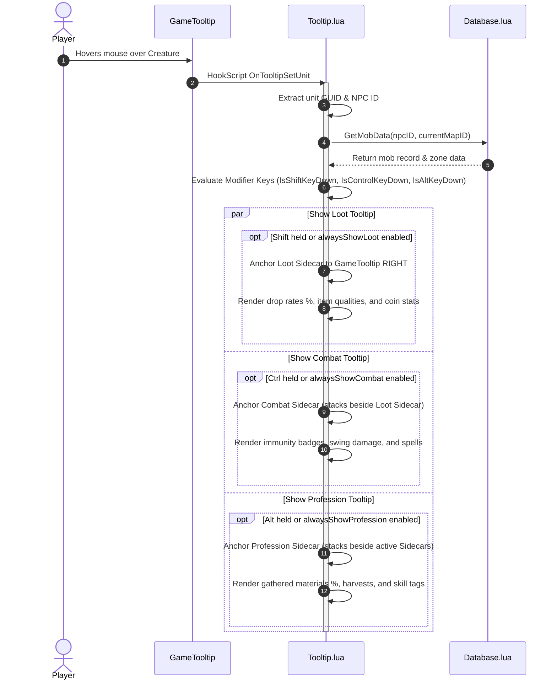

# Azeroth Creature Compendium - System Architecture

> **Document Version:** 1.0.0  
> **Target Environment:** World of Warcraft Classic (Interface: 11504, 11505, 11506, 11503, 11404)  
> **Status:** Active / Production  
> **Audience:** Senior Architects, Junior Developers, Executives, and AI Coding Agents

---

## 📑 Table of Contents
1. [Executive Summary](#-executive-summary)
2. [High-Level System Architecture](#-high-level-system-architecture)
3. [Component Breakdown & File Registry](#-component-breakdown--file-registry)
4. [Core Execution Pipelines (Sequence Diagrams)](#-core-execution-pipelines-sequence-diagrams)
   - [Addon Lifecycle & Initialization](#1-addon-lifecycle--initialization)
   - [Combat & Taint-Free Immunity Detection](#2-combat--taint-free-immunity-detection)
   - [Loot & Profession Gathering Pipeline](#3-loot--profession-gathering-pipeline)
   - [Sidecar Tooltip Multi-Docking Engine](#4-sidecar-tooltip-multi-docking-engine)
5. [Database Architecture & Schema Specification](#-database-architecture--schema-specification)
6. [Key Engineering & Design Decisions](#-key-engineering--design-decisions)
7. [Guidelines for Contributors & AI Agents](#-guidelines-for-contributors--ai-agents)

---

## 🏛️ Executive Summary

The **Azeroth Creature Compendium (ACC)** is a production-grade World of Warcraft Classic addon engineered to operate as a local, fully autonomous in-game Pokédex. It dynamically discovers, catalogs, analyzes, and indexes creature behavior, drop tables, profession gathers, auto-attack metrics, and combat immunities through non-invasive observation of native game events.

### Architectural Tenets
- **Zero-Taint Integrity:** Operates without hooking protected action buttons or subscribing to restricted combat log streams (`COMBAT_LOG_EVENT_UNFILTERED`), eliminating combat action blocked errors (Lua taint).
- **Decoupled Event-Driven Core:** Strict separation between event listeners (Inference Engines), data persistence (Storage Layer), and presentation (Sidecar Tooltips, Pokédex Window, Options Panel).
- **Single Source of Truth:** Centralized database (`AzerothCreatureCompendiumDB`) managed through authoritative mutation methods with full backward compatibility and automated schema migration.
- **Low Memory & CPU Footprint:** Bounded cache ring buffers (capped at 400 entries) and lightweight on-demand calculations prevent frame drops and memory leaks during multi-hour raid and farming sessions.

---

## 📐 High-Level System Architecture

The following diagram illustrates the flow of data from native World of Warcraft C-engine events through our observation layer, down into persistent storage, and up to the player-facing presentation frames.



---

## 📦 Component Breakdown & File Registry

The addon is modularized across seven specialized Lua files plus the TOC manifest. Load order is strictly sequential as defined in [AzerothCreatureCompendium.toc](../AzerothCreatureCompendium.toc).

| Execution Order | File | Responsibility | Primary APIs / Exports |
| :--- | :--- | :--- | :--- |
| **1** | [Config.lua](../Config.lua) | Global namespace initialization, dynamic TOC version resolution, constant definitions, color matrices, default preferences, and slash command registries. | `addon.DEFAULT_SETTINGS`, `addon.QUALITY_HEX`, `addon.SCHOOL_MASKS`, `addon.IMMUNITY_COLORS` |
| **2** | [Database.lua](../Database.lua) | State management, SavedVariables lifecycle, schema normalization, legacy DB auto-migration, drop-rate math, query helpers, and test data seeding. | `addon:InitDatabase()`, `addon:GetOrCreateMob()`, `addon:RecordLoot()`, `addon:RecordProfessionLoot()`, `addon:RecordSpellCast()`, `addon:RecordImmunity()`, `addon:GetMobData()` |
| **3** | [CombatLog.lua](../CombatLog.lua) | Taint-free combat discovery engine. Observes spellcasts and correlates error notifications to detect school/mechanic immunities without accessing restricted combat logs. | `InferSpellSchool()`, `MatchMechanicByName()`, `AzerothCompendiumCombatListenerFrame` |
| **4** | [Core.lua](../Core.lua) | Master event listener, creature unit inspector, corpse GUID tracking, profession harvest correlation, and coin transaction parser. | `addon:ProcessLoot()`, `addon:CacheUnit()`, `addon:IdentifyGatheringSpell()`, `addon:GetPlayerLocation()`, `addon:GetNPCIDFromGUID()` |
| **5** | [Tooltip.lua](../Tooltip.lua) | Tri-sidecar companion tooltips (Loot, Combat, Professions) anchored next to Blizzard's native `GameTooltip` with live modifier detection and dynamic screen clamping. | `addon:ShowMobTooltip()`, `addon:FormatCoinString()`, `AzerothCompendiumLootTooltip`, `AzerothCompendiumCombatTooltip`, `AzerothCompendiumProfessionTooltip` |
| **6** | [CompendiumWindow.lua](../CompendiumWindow.lua) | Two-pane Pokédex browser (`/acc`). Features live search, collapsible Zone tree, 3D interactive model rendering with mouse drag rotation, tabbed metadata cards, and minimap button. | `addon:CreateCompendiumWindow()`, `addon:ToggleCompendiumWindow()`, `addon:CreateMinimapButton()` |
| **7** | [Options.lua](../Options.lua) | Blizzard Interface Options integration (`Settings.RegisterAddOnCategory`), UI sliders, dropdowns, and keybinding selectors with live updates. | `addon:CreateOptionsPanel()` |

---

## 🔄 Core Execution Pipelines (Sequence Diagrams)

### 1. Addon Lifecycle & Initialization

When the game client loads the addon files, the following boot sequence guarantees backward compatibility, defaults merging, and state integrity before any player interaction.



---

### 2. Combat & Taint-Free Immunity Detection

Rather than listening to `COMBAT_LOG_EVENT_UNFILTERED` (which triggers Blizzard UI taint restrictions during combat), the compendium uses a **two-phase correlation engine**:
1. When the player casts an offensive spell, the spell ID and name are cached.
2. If the client fires `UI_ERROR_MESSAGE` with "Target is immune", the engine correlates the error message with the cached spell to record either a **School Immunity** (Fire, Frost, Nature, etc.) or a **Mechanic Immunity** (Taunt, Stun, Bleed, etc.).



---

### 3. Loot & Profession Gathering Pipeline

The compendium differentiates standard mob corpse looting from secondary harvesting professions (Skinning, Mining, Herbalism, Engineering) by correlating gathering cast completions with subsequent loot window events.



---

### 4. Sidecar Tooltip Multi-Docking Engine

When the player hovers over a creature in the 3D world or unit frame, the compendium anchors up to three dedicated sidecars without overlapping or obscuring Blizzard's `GameTooltip`.



---

## 🗄️ Database Architecture & Schema Specification

All persistent data is consolidated into a single SavedVariable dictionary: `AzerothCreatureCompendiumDB`.

### Entity Relationship Model

```text
AzerothCreatureCompendiumDB
├── version: number (e.g. 2)
├── settings: table (Modifier keys, display limits, minimap settings)
├── npcToZones: map<npcID, map<mapID, true>> (Inverted index for O(1) cross-zone lookups)
└── zones: map<mapID, ZoneObject>
      └── [mapID]:
            ├── id: number (Blizzard UiMapID)
            ├── name: string (e.g. "Dun Morogh")
            └── mobs: map<npcID, MobObject>
                  └── [npcID]:
                        ├── npcID: number
                        ├── name: string
                        ├── classification: "normal" | "rare" | "elite" | "rareelite" | "worldboss"
                        ├── creatureType: string (e.g. "Beast", "Humanoid", "Undead")
                        ├── minLevel: number
                        ├── maxLevel: number
                        ├── kills: number
                        ├── encounters: number
                        ├── firstSeen: timestamp
                        ├── lastSeen: timestamp
                        ├── coords: Array<{x: number, y: number, time: timestamp}> (Rare spawns only)
                        │
                        ├── combat: CombatObject (Sibling 1)
                        │     ├── attacks: { swings: n, minDmg: n, maxDmg: n, totalDmg: n, avgDmg: n, school: n }
                        │     ├── spells: map<spellID, SpellObject>
                        │     │     └── [spellID]: { id, name, icon, school, casts, minDmg, maxDmg, totalDmg, avgDmg, isHeal, isBuff, isDebuff }
                        │     └── immunities: map<immunityKey, ImmunityObject>
                        │           └── [immunityKey]: { key, type ("SCHOOL"|"MECHANIC"), name, school, count, firstSeen, lastSeen }
                        │
                        ├── loot: LootObject (Sibling 2)
                        │     ├── totalLoots: number
                        │     ├── emptyLoots: number
                        │     ├── totalMoney: number (copper)
                        │     ├── avgMoney: number (copper)
                        │     ├── coords: Array<{x, y, time}>
                        │     └── items: map<itemID, ItemObject>
                        │           └── [itemID]: { id, name, quality, icon, itemLink, dropLootCount, totalQuantity, dropRatePercent, dropRateDecimal, dropChance }
                        │
                        └── professions: ProfessionObject (Sibling 3)
                              ├── totalHarvests: number
                              ├── emptyHarvests: number
                              ├── bySkill: map<skillName, { totalHarvests, emptyHarvests }>
                              └── items: map<itemID, ProfessionItemObject>
                                    └── [itemID]: { id, name, quality, icon, itemLink, harvestCount, totalQuantity, dropRatePercent, dropChance, profession }
```

---

## 💡 Key Engineering & Design Decisions

### 1. Taint-Safe Event Listening over Combat Log Streaming
- **Context:** In World of Warcraft Classic, addons that read restricted combat log channels or hook protected combat actions risk "tainting" the execution environment, causing game-breaking errors like `Action blocked by an addon`.
- **Decision:** The compendium strictly avoids `COMBAT_LOG_EVENT_UNFILTERED`. Instead, it uses public, unrestricted unit event channels (`UNIT_SPELLCAST_START`, `UNIT_SPELLCAST_SENT`, `UI_ERROR_MESSAGE`, `PLAYER_TARGET_CHANGED`). This guarantees 100% taint immunity in raids and PvP.

### 2. Memory-Bounded Ring Buffers for Deduplication
- **Context:** Rapid looting and harvesting during farming sessions could produce memory growth or double-count drops if loot windows are repeatedly opened.
- **Decision:** Both `lootedCorpseGUIDs` and `harvestedCorpseGUIDs` utilize a FIFO ring buffer capped at 400 entries. Old entries are automatically pruned, keeping memory usage constant and lightweight.

### 3. Strict Coordinate Recording Policy for Rare Spawns
- **Context:** Recording coordinate breadcrumbs for every standard trash mob across Azeroth bloats the SavedVariables file with megabytes of redundant data.
- **Decision:** Coordinate recording is strictly gatekept to **Rare Spawns** (`rare` and `rareelite` classifications). Standard mobs do not persist coordinates, keeping the database lean and meaningful.

### 4. Non-Destructive Auto-Migration
- **Context:** Users upgrading from legacy versions (`BgLootLogger`) must not lose previously recorded mob drop data.
- **Decision:** On initial load, the migration engine detects legacy tables, upgrades schema objects to the 3-sibling hierarchy (`Combat`, `Loot`, `Professions`), and maintains synchronized backward-compatible aliases.

### 5. Automated CI/CD Release Pipeline & Semantic Versioning
- **Context:** Manual zip archiving and uploading to CurseForge/GitHub is error-prone, risks committing local development artifacts, and causes version drift between TOC manifests and in-game UI.
- **Decision:** Releases are automated via `BigWigsMods/packager@v2` triggered on Git tag push (`v*`). Development tools and docs are excluded via `.pkgmeta`. The TOC manifest and config dynamically interpolate `@project-version@` tags into the authoritative `addon.VERSION` constant, adhering strictly to Semantic Versioning (`MAJOR.MINOR.PATCH`).

---

## 🤖 Guidelines for Contributors & AI Agents

When implementing new features or modifying the codebase, adhere to these mandatory conventions:

1. **TOC Load Order Preservation:** Never reorder files in [AzerothCreatureCompendium.toc](../AzerothCreatureCompendium.toc) without updating dependencies. `Config.lua` and `Database.lua` must always load before consumers.
2. **Database Mutations via Factory:** Always mutate mob records using `addon:GetOrCreateMob()` or dedicated recording methods (`RecordLoot`, `RecordSpellCast`, etc.). Never assign raw tables directly into `db.zones[mapID].mobs[npcID]`.
3. **No Unfiltered Combat Log Hooks:** Do not introduce `COMBAT_LOG_EVENT_UNFILTERED`. If new combat data is needed, find a public unit event alternative.
4. **Coordinate Policy Adherence:** Never record coordinates for non-rare creatures unless explicitly configured by the user.
5. **UI Scaling & Screen Clamping:** When modifying sidecar or browser frames, ensure `SetClampedToScreen(true)` and dynamic parent scaling are preserved so elements render properly across 1080p, 1440p, 4K, and custom UI scales.
6. **Deploy & Validate:** Always verify scripts via PowerShell syntax checking and test deployment using [deploy.ps1](../deploy.ps1).
