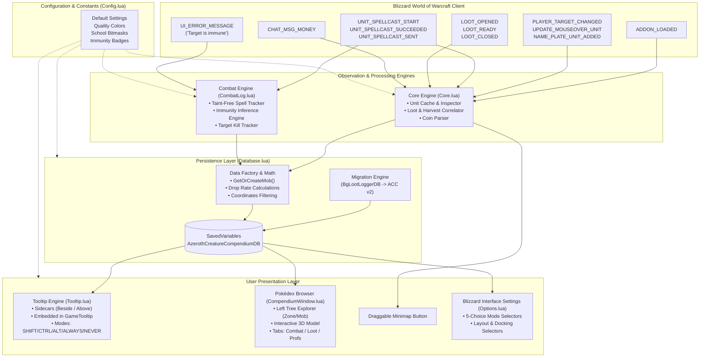
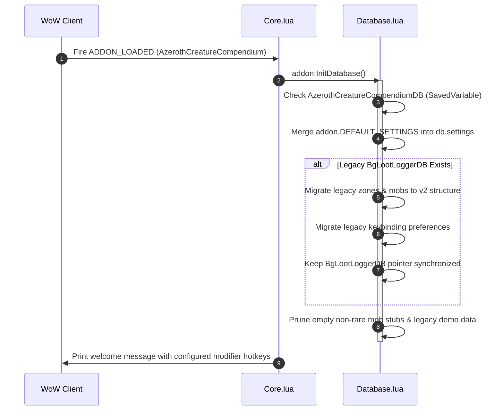
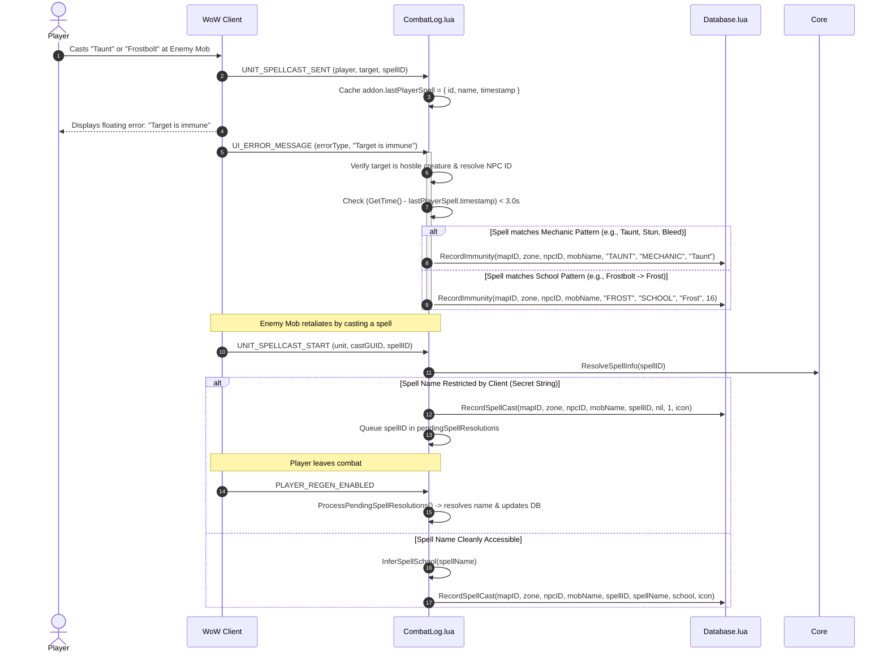
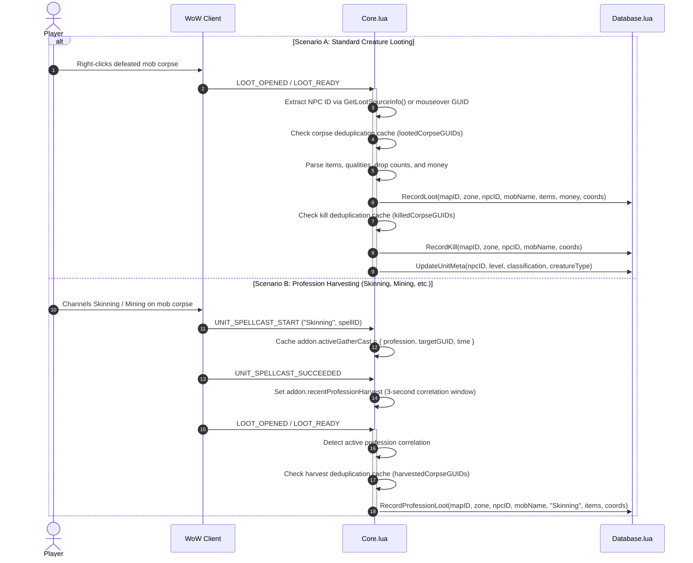
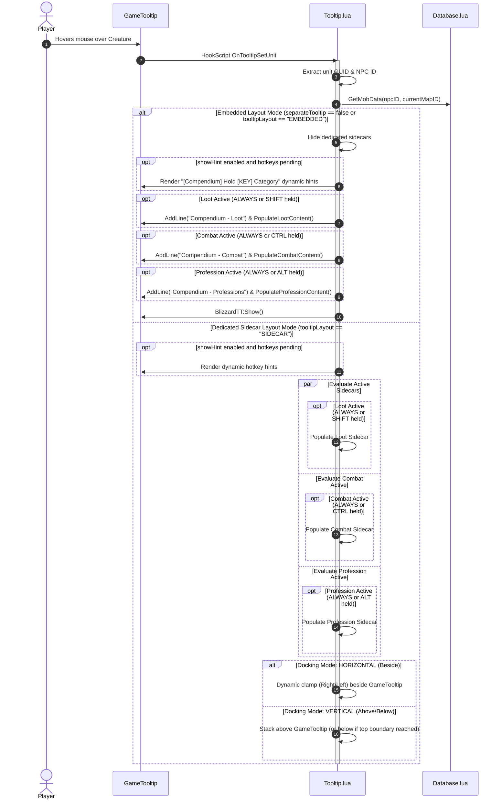

# Azeroth Creature Compendium - System Architecture

> **Document Version:** 1.0.1  
> **Target Environment:** World of Warcraft Classic & Forever Beta (Interface: 11506, 11505, 11504, 11503, 11404, 16001)  
> **Status:** Active / Production  
> **Audience:** Senior Architects, Junior Developers, Executives, and AI Coding Agents

---

## 📑 Table of Contents
1. [Executive Summary](#-executive-summary)
2. [High-Level System Architecture](#-high-level-system-architecture)
3. [Component Breakdown & File Registry](#-component-breakdown--file-registry)
4. [Core Execution Pipelines (Sequence Diagrams)](#-core-execution-pipelines-sequence-diagrams)
   - [Addon Lifecycle & Initialization](#1-addon-lifecycle--initialization)
   - [Combat & Taint-Free Immunity Detection](#2-combat--taint-free-immunity-detection)
   - [Loot & Profession Gathering Pipeline](#3-loot--profession-gathering-pipeline)
   - [Sidecar Tooltip Multi-Docking Engine](#4-sidecar-tooltip-multi-docking-engine)
5. [Database Architecture & Schema Specification](#-database-architecture--schema-specification)
6. [Key Engineering & Design Decisions](#-key-engineering--design-decisions)
7. [Guidelines for Contributors & AI Agents](#-guidelines-for-contributors--ai-agents)

---

## 🏛️ Executive Summary

The **Azeroth Creature Compendium (ACC)** is a production-grade World of Warcraft Classic addon engineered to operate as a local, fully autonomous in-game Pokédex. It dynamically discovers, catalogs, analyzes, and indexes creature behavior, drop tables, profession gathers, auto-attack metrics, and combat immunities through non-invasive observation of native game events.

### Architectural Tenets
- **Zero-Taint Integrity:** Operates without hooking protected action buttons or subscribing to restricted combat log streams (`COMBAT_LOG_EVENT_UNFILTERED`), eliminating combat action blocked errors (Lua taint).
- **Decoupled Event-Driven Core:** Strict separation between event listeners (Inference Engines), data persistence (Storage Layer), and presentation (Sidecar Tooltips, Pokédex Window, Options Panel).
- **Single Source of Truth:** Centralized database (`AzerothCreatureCompendiumDB`) managed through authoritative mutation methods with full backward compatibility and automated schema migration.
- **Low Memory & CPU Footprint:** Bounded cache ring buffers (capped at 400 entries) and lightweight on-demand calculations prevent frame drops and memory leaks during multi-hour raid and farming sessions.

---

## 📐 High-Level System Architecture

The following diagram illustrates the flow of data from native World of Warcraft C-engine events through our observation layer, down into persistent storage, and up to the player-facing presentation frames.



---

## 📦 Component Breakdown & File Registry

The addon is modularized across seven specialized Lua files plus the TOC manifest. Load order is strictly sequential as defined in [AzerothCreatureCompendium.toc](../AzerothCreatureCompendium.toc).

| Execution Order | File | Responsibility | Primary APIs / Exports |
| :--- | :--- | :--- | :--- |
| **1** | [Config.lua](../Config.lua) | Global namespace initialization, dynamic TOC version resolution, constant definitions, color matrices, default preferences, secret value detection/sanitization, and slash command registries. | `addon:IsSecretValue()`, `addon:SafeString()`, `addon.DEFAULT_SETTINGS`, `addon.QUALITY_HEX`, `addon.SCHOOL_MASKS`, `addon.IMMUNITY_COLORS` |
| **2** | [Database.lua](../Database.lua) | State management, SavedVariables lifecycle, schema normalization, legacy DB auto-migration, drop-rate math, query helpers, rank calculations, secret value sanitization, on-demand deferred spell resolution, and demo data sanitization. | `addon:InitDatabase()`, `addon:GetOrCreateMob()`, `addon:RecordLoot()`, `addon:RecordProfessionLoot()`, `addon:RecordSpellCast()`, `addon:RecordImmunity()`, `addon:GetMobData()`, `addon:GetMobResearchRank()` |
| **3** | [CombatLog.lua](../CombatLog.lua) | Taint-free combat discovery engine. Observes spellcasts, deferred out-of-combat spell resolution, and correlates error notifications to detect school/mechanic immunities without accessing restricted combat logs. | `InferSpellSchool()`, `MatchMechanicByName()`, `addon:ProcessPendingSpellResolutions()`, `AzerothCompendiumCombatListenerFrame` |
| **4** | [Core.lua](../Core.lua) | Master event listener, creature unit inspector, corpse GUID tracking, profession harvest correlation, coin transaction parser, and safe spell info resolver. | `addon:ResolveSpellInfo()`, `addon:GetSpellName()`, `addon:ProcessLoot()`, `addon:CacheUnit()`, `addon:IdentifyGatheringSpell()`, `addon:GetPlayerLocation()`, `addon:GetNPCIDFromGUID()` |
| **5** | [Tooltip.lua](../Tooltip.lua) | Dual tooltip layout engine: Dedicated Tri-sidecars (with dynamic Beside or Above/Below screen docking, and Main Tooltip vs Mouse Cursor anchoring) or single merged `GameTooltip` embedding with live modifier detection (`SHIFT`/`CTRL`/`ALT`/`ALWAYS`/`NEVER`) and first mob encounter discovery placeholders. | `addon:ShowMobTooltip()`, `addon:FormatCoinString()`, `addon:UpdateCompanionTooltips()`, `addon:IsEmbeddedLayout()`, `addon:GetTooltipHintText()`, `AzerothCompendiumLootTooltip`, `AzerothCompendiumCombatTooltip`, `AzerothCompendiumProfessionTooltip` |
| **6** | [CompendiumWindow.lua](../CompendiumWindow.lua) | Two-pane Pokédex browser (`/acc`). Features live search, collapsible Zone tree (with hover tooltips for Bestiary Progression ranks), 3D interactive model rendering with mouse drag rotation, tabbed metadata cards, Bestiary Progression Rank display, and minimap button. | `addon:CreateCompendiumWindow()`, `addon:ToggleCompendiumWindow()`, `addon:CreateMinimapButton()` |
| **7** | [Options.lua](../Options.lua) | Blizzard Interface Options integration (`Settings.RegisterCanvasLayoutCategory`), 5-mode activation button selectors (`SHIFT`, `CTRL`, `ALT`, `ALWAYS`, `NEVER`), layout mode buttons (`SIDECAR` vs `EMBEDDED`), anchor point buttons (`BLIZZARD` vs `CURSOR`), sidecar docking selectors (`HORIZONTAL` vs `VERTICAL`), and feature checkboxes. | `addon:RefreshOptionsHotkeys()`, `addon:RefreshOptionsLayout()`, `addon:OpenOptions()` |

### Packaging & Release Manifests

| File | Purpose | Consumers |
| :--- | :--- | :--- |
| [AzerothCreatureCompendium.toc](../AzerothCreatureCompendium.toc) | Blizzard addon manifest defining load order, SavedVariables, interface versions, and metadata. | World of Warcraft Client, BigWigs Packager |
| [.pkgmeta](../.pkgmeta) | Packaging configuration: specifies zip ignore patterns and binds `manual-changelog` to `CHANGELOG.md`. | BigWigs Packager (`release.sh`) |
| [CHANGELOG.md](../CHANGELOG.md) | Single source of truth for player-centric release notes. Consumed by BigWigs Packager to publish clean notes on CurseForge. | CurseForge, GitHub Releases, End Users |
| [.luacheckrc](../.luacheckrc) | Static analysis configuration for LuaCheck defining WoW Classic globals and code quality rules. | GitHub Actions CI (`lint.yml`), `lint.ps1`, Developers |
| [lint.ps1](../lint.ps1) | Local Windows PowerShell runner that executes or auto-downloads LuaCheck and generates audit reports. | Developers, AI Agents |
| [.github/workflows/lint.yml](../.github/workflows/lint.yml) | Continuous Integration workflow running `lunarmodules/luacheck@v1` on pushes and PRs. | GitHub Actions CI |

---

## 🔄 Core Execution Pipelines (Sequence Diagrams)

### 1. Addon Lifecycle & Initialization

When the game client loads the addon files, the following boot sequence guarantees backward compatibility, defaults merging, and state integrity before any player interaction.



---

### 2. Combat & Taint-Free Immunity Detection

Rather than listening to `COMBAT_LOG_EVENT_UNFILTERED` (which triggers Blizzard UI taint restrictions during combat), the compendium uses a **two-phase correlation engine**:
1. When the player casts an offensive spell, the spell ID and name are cached.
2. If the client fires `UI_ERROR_MESSAGE` with "Target is immune", the engine correlates the error message with the cached spell to record either a **School Immunity** (Fire, Frost, Nature, etc.) or a **Mechanic Immunity** (Taunt, Stun, Bleed, etc.).



---

### 3. Loot & Profession Gathering Pipeline

The compendium differentiates standard mob corpse looting from secondary harvesting professions (Skinning, Mining, Herbalism, Engineering) by correlating gathering cast completions with subsequent loot window events.



---

### 4. Dual Tooltip Layout & Docking Engine

When the player hovers over a creature in the 3D world or unit frame, the compendium dynamically evaluates the player's configured layout (`SIDECAR` vs `EMBEDDED`) and activation modes (`SHIFT`, `CTRL`, `ALT`, `ALWAYS`, `NEVER`).



---

## 🗄️ Database Architecture & Schema Specification

All persistent data is consolidated into a single SavedVariable dictionary: `AzerothCreatureCompendiumDB`.

### Entity Relationship Model

```text
AzerothCreatureCompendiumDB
├── version: number (e.g. 2)
├── settings: table
│     ├── modifierKeyLoot: "SHIFT" | "CTRL" | "ALT" | "ALWAYS" | "NEVER"
│     ├── modifierKeyCombat: "SHIFT" | "CTRL" | "ALT" | "ALWAYS" | "NEVER"
│     ├── modifierKeyProfession: "SHIFT" | "CTRL" | "ALT" | "ALWAYS" | "NEVER"
│     ├── tooltipLayout: "SIDECAR" | "EMBEDDED"
│     ├── tooltipAnchor: "BLIZZARD" | "CURSOR"
│     ├── sidecarAnchor: "HORIZONTAL" | "VERTICAL"
│     ├── separateTooltip: boolean (legacy alias)
│     ├── maxItems: number
│     ├── maxSpells: number
│     ├── minQuality: number
│     ├── showMoney: boolean
│     ├── showHint: boolean
│     ├── showSample: boolean
│     ├── showMinimap: boolean
│     ├── trackCombat: boolean
│     └── trackImmunities: boolean
├── npcToZones: map<npcID, map<mapID, true>> (Inverted index for O(1) cross-zone lookups)
└── zones: map<mapID, ZoneObject>
      └── [mapID]:
            ├── id: number (Blizzard UiMapID)
            ├── name: string (e.g. "Dun Morogh")
            └── mobs: map<npcID, MobObject>
                  └── [npcID]:
                        ├── npcID: number
                        ├── name: string
                        ├── classification: "normal" | "rare" | "elite" | "rareelite" | "worldboss"
                        ├── creatureType: string (e.g. "Beast", "Humanoid", "Undead")
                        ├── minLevel: number
                        ├── maxLevel: number
                        ├── kills: number
                        ├── encounters: number
                        ├── firstSeen: timestamp
                        ├── lastSeen: timestamp
                        ├── coords: Array<{x: number, y: number, time: timestamp}> (Rare spawns only)
                        │
                        ├── combat: CombatObject (Sibling 1)
                        │     ├── attacks: { swings: n, minDmg: n, maxDmg: n, totalDmg: n, avgDmg: n, school: n }
                        │     ├── spells: map<spellID, SpellObject>
                        │     │     └── [spellID]: { id, name, icon, school, casts, minDmg, maxDmg, totalDmg, avgDmg, isHeal, isBuff, isDebuff }
                        │     └── immunities: map<immunityKey, ImmunityObject>
                        │           └── [immunityKey]: { key, type ("SCHOOL"|"MECHANIC"), name, school, count, firstSeen, lastSeen }
                        │
                        ├── loot: LootObject (Sibling 2)
                        │     ├── totalLoots: number
                        │     ├── emptyLoots: number
                        │     ├── totalMoney: number (copper)
                        │     ├── avgMoney: number (copper)
                        │     ├── coords: Array<{x, y, time}>
                        │     └── items: map<itemID, ItemObject>
                        │           └── [itemID]: { id, name, quality, icon, itemLink, dropLootCount, totalQuantity, dropRatePercent, dropRateDecimal, dropChance }
                        │
                        └── professions: ProfessionObject (Sibling 3)
                              ├── totalHarvests: number
                              ├── emptyHarvests: number
                              ├── bySkill: map<skillName, { totalHarvests, emptyHarvests }>
                              └── items: map<itemID, ProfessionItemObject>
                                    └── [itemID]: { id, name, quality, icon, itemLink, harvestCount, totalQuantity, dropRatePercent, dropChance, profession }
```

---

## 💡 Key Engineering & Design Decisions

### 1. Taint-Safe Event Listening over Combat Log Streaming
- **Context:** In World of Warcraft Classic, addons that read restricted combat log channels or hook protected combat actions risk "tainting" the execution environment, causing game-breaking errors like `Action blocked by an addon`.
- **Decision:** The compendium strictly avoids `COMBAT_LOG_EVENT_UNFILTERED`. Instead, it uses public, unrestricted unit event channels (`UNIT_SPELLCAST_START`, `UNIT_SPELLCAST_SENT`, `UI_ERROR_MESSAGE`, `PLAYER_TARGET_CHANGED`). This guarantees 100% taint immunity in raids and PvP.

### 2. Memory-Bounded Ring Buffers for Deduplication
- **Context:** Rapid looting and harvesting during farming sessions could produce memory growth or double-count drops if loot windows are repeatedly opened.
- **Decision:** Both `lootedCorpseGUIDs` and `harvestedCorpseGUIDs` utilize a FIFO ring buffer capped at 400 entries. Old entries are automatically pruned, keeping memory usage constant and lightweight.

### 3. Strict Coordinate Recording Policy for Rare Spawns
- **Context:** Recording coordinate breadcrumbs for every standard trash mob across Azeroth bloats the SavedVariables file with megabytes of redundant data.
- **Decision:** Coordinate recording is strictly gatekept to **Rare Spawns** (`rare` and `rareelite` classifications). Standard mobs do not persist coordinates, keeping the database lean and meaningful.

### 4. Non-Destructive Auto-Migration
- **Context:** Users upgrading from legacy versions (`BgLootLogger`) must not lose previously recorded mob drop data.
- **Decision:** On initial load, the migration engine detects legacy tables, upgrades schema objects to the 3-sibling hierarchy (`Combat`, `Loot`, `Professions`), and maintains synchronized backward-compatible aliases.

### 5. Automated CI/CD Release Pipeline & Semantic Versioning
- **Context:** Manual zip archiving and uploading to CurseForge/GitHub is error-prone, risks committing local development artifacts, causes version drift between TOC manifests and in-game UI, and leaks internal git commit logs into public release notes.
- **Decision:** Releases are automated via `BigWigsMods/packager@v2` triggered on Git tag push (`v*`). Development tools and docs are excluded via [`.pkgmeta`](../.pkgmeta). To guarantee clean, player-centric release notes on CurseForge without git commit dumps or issue closures, `.pkgmeta` configures `manual-changelog` pointing to [`CHANGELOG.md`](../CHANGELOG.md). The TOC manifest and config dynamically interpolate `@project-version@` tags into the authoritative `addon.VERSION` constant, adhering strictly to Semantic Versioning (`MAJOR.MINOR.PATCH`).

### 6. Automated Static Analysis & WoW Global Whitelisting
- **Context:** Unchecked Lua code easily introduces global variable pollution (e.g. omitting `local`), silent typos in handler names, and dead variables that complicate debugging and cause memory overhead. However, standard linters emit hundreds of false-positive warnings for World of Warcraft's global API surface.
- **Decision:** Continuous integration enforces `luacheck` via `.github/workflows/lint.yml` against an authoritative [`.luacheckrc`](../.luacheckrc) configured specifically for WoW Classic. Developers and AI agents can validate changes locally using [lint.ps1](../lint.ps1). Zero warnings and zero errors are enforced.

### 7. Secret Value & Taint-Safe Protection (WoW 11.0+ / 12.0+ Compatibility)
- **Context:** In modern World of Warcraft engine builds, Blizzard introduced a security sandbox where unit metadata, event payloads (`spellID`), and spell names (`C_Spell.GetSpellInfo`) frequently return "secret values" when queried in restricted combat contexts. Any attempt to perform string operations on secret strings triggers `attempt to perform string conversion on a secret string value`, and using secret numbers as table keys triggers `attempted to perform indexed assignment on a table that cannot be indexed with secret keys`.
- **Decision:** The compendium implements a defensive sanitization barrier:
  1. `addon:IsSecretValue(val)` safely guards all inputs using `issecretvalue()` and protected call (`pcall`) guards.
  2. If the `spellID` returned from `UNIT_SPELLCAST_START` is a secret number, the engine gracefully attempts a fallback query to the global `UnitCastingInfo` or `UnitChannelInfo` APIs to fetch an untainted ID. If the fallback is also restricted, the event is safely dropped to guarantee zero UI crashes.
  3. If the spell name is secret during combat, it is temporarily recorded with a placeholder (`"Spell <id>"`) and queued in `addon.pendingSpellResolutions`.
  4. When combat drops (`PLAYER_REGEN_ENABLED`) or when mob data is retrieved for tooltips/browser (`GetMobData`), deferred spells are automatically resolved to their true names, icons, and inferred spell schools once client restrictions are lifted.

---

## 🤖 Guidelines for Contributors & AI Agents

When implementing new features or modifying the codebase, adhere to these mandatory conventions:

1. **TOC Load Order Preservation:** Never reorder files in [AzerothCreatureCompendium.toc](../AzerothCreatureCompendium.toc) without updating dependencies. `Config.lua` and `Database.lua` must always load before consumers.
2. **Database Mutations via Factory:** Always mutate mob records using `addon:GetOrCreateMob()` or dedicated recording methods (`RecordLoot`, `RecordSpellCast`, etc.). Never assign raw tables directly into `db.zones[mapID].mobs[npcID]`.
3. **No Unfiltered Combat Log Hooks:** Do not introduce `COMBAT_LOG_EVENT_UNFILTERED`. If new combat data is needed, find a public unit event alternative.
4. **Coordinate Policy Adherence:** Never record coordinates for non-rare creatures unless explicitly configured by the user.
5. **UI Scaling & Screen Clamping:** When modifying sidecar or browser frames, ensure `SetClampedToScreen(true)` and dynamic parent scaling are preserved so elements render properly across 1080p, 1440p, 4K, and custom UI scales.
6. **Deploy & Validate:** Always verify scripts via PowerShell syntax checking and test deployment using [deploy.ps1](../deploy.ps1).
7. **Static Analysis & Linting:** Always run `powershell -ExecutionPolicy Bypass -File .\lint.ps1` before proposing changes. Code must pass with 0 warnings and 0 errors against `.luacheckrc`.

